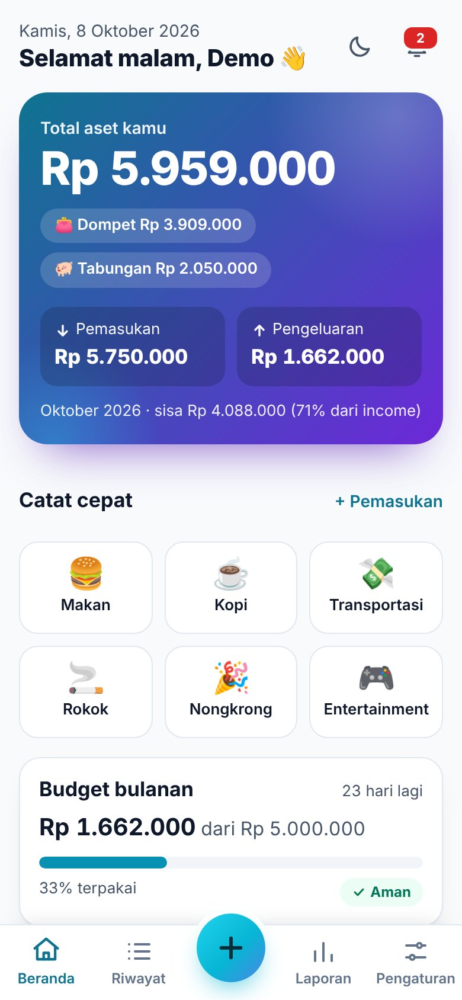
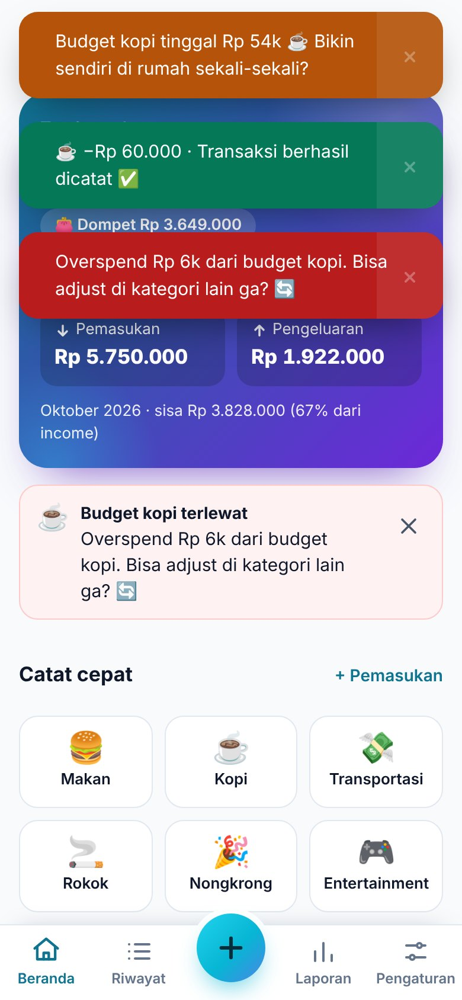
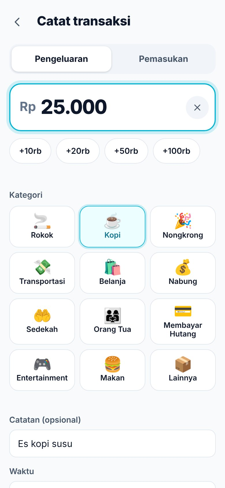
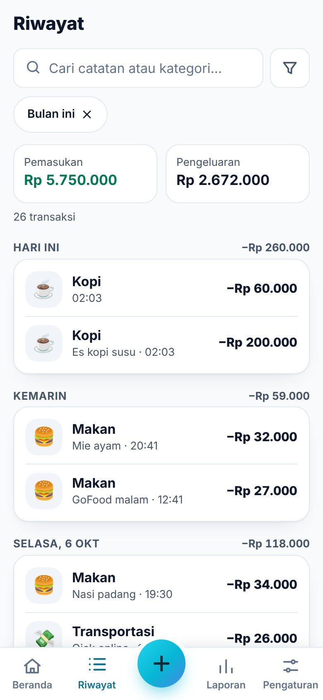
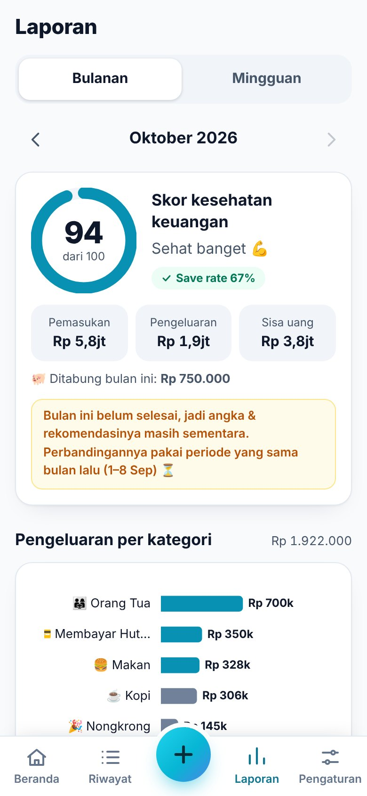
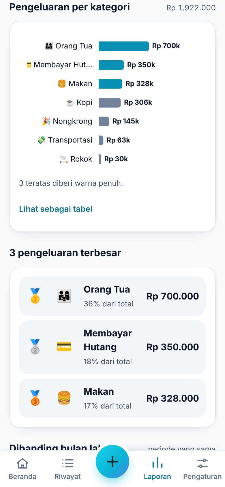
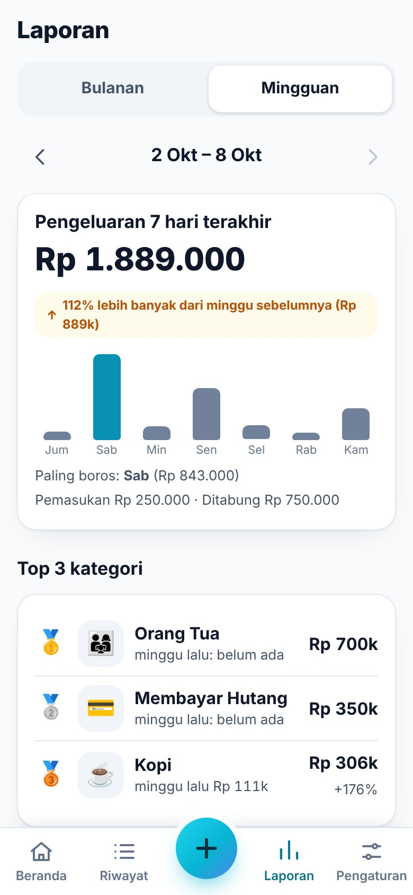
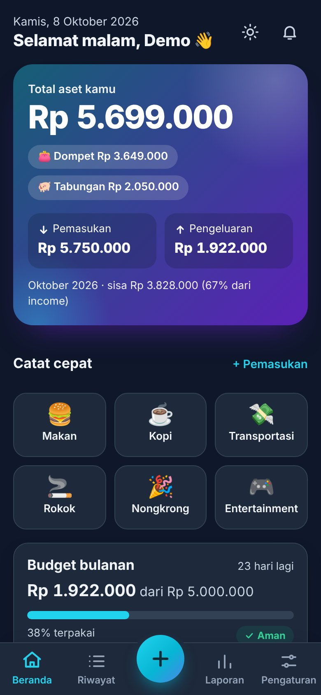

# PANTAU 💸

**P**antau **A**set **N**abung **T**erus **A**tur **U**ang — web app pencatat pemasukan & pengeluaran buat anak muda Indonesia (18–30 tahun) yang suka "kalap" pas ngeluarin duit. Ada pengingat budget yang santai (bukan menghakimi), ringkasan mingguan, dan rekomendasi bulanan yang actionable. 100% Bahasa Indonesia.

Full-stack: **HTML/CSS/JS vanilla** + **Node.js/Express** + **MongoDB**. Dirancang mobile-first (portrait, 320–480px).

| | | | |
|---|---|---|---|
|  |  |  |  |
| Beranda | Alert budget 3-tier | Catat transaksi | Riwayat |
|  |  |  |  |
| Laporan bulanan | Grafik kategori | Laporan mingguan | Mode gelap |

Screenshot lain: [login](docs/screenshots/01-login.jpg) · [budget](docs/screenshots/03-dashboard-budget.jpg) · [inbox](docs/screenshots/11-inbox.jpg) · [pengaturan](docs/screenshots/12-settings.jpg). Semuanya diambil di viewport 390×844 portrait.

---

## ✨ Fitur

- **Catat cepat** pemasukan/pengeluaran: kategori beremoji, nominal berformat `Rp 1.234.567`, catatan, waktu otomatis (bisa diubah), tombol quick-add untuk kategori yang paling sering dipakai, edit & hapus.
- **Notifikasi budget 3-tier** real-time saat transaksi disimpan: **60%** (info, santai) → **80%** (colekan halus) → **100%** (alert yang suportif). Teks spesifik per kategori dengan angka nyata ("Rokok budget tinggal Rp 50k. Kurangin dikit yuk? 🚬").
- **Analisis mingguan**: ringkasan 7 hari, top 3 kategori, naik/turun vs minggu lalu, satu rekomendasi.
- **Analisis & rekomendasi bulanan**: total income/expense/sisa uang, breakdown kategori (grafik), tren naik/turun, top 3 pengeluaran, **skor kesehatan keuangan 0–100**, status budget, dan rekomendasi ("Kalau dikurangin 20%, bisa kumpul Rp 180k/bulan…").
- **Inbox notifikasi in-app** (alert budget, ringkasan mingguan Minggu 19:00, laporan bulanan akhir bulan 20:00).
- Riwayat dengan **cari + filter** (periode, tipe, kategori, rentang nominal & tanggal), dikelompokkan per hari, 50 per halaman.
- **Pengaturan**: budget per kategori (auto-save), budget bulanan total, kelola kategori, mode gelap, atur notifikasi, **ekspor CSV/JSON**, reset data.
- Mode gelap, toast, animasi halus (menghormati `prefers-reduced-motion`), skeleton loading, empty state.

## 🚀 Jalankan lokal

Butuh **Node.js ≥ 20.19** (lihat `.node-version`).

### A. Mode demo — tanpa instalasi MongoDB (paling cepat)

```bash
npm run setup      # install dependency backend (sekali saja)
npm run demo       # nyalakan MongoDB sementara + isi data demo + jalankan server
```

Buka <http://localhost:3000> lalu tekan **Coba akun demo**, atau login manual: `email@test.com` / `password123` (data ±3 bulan). Data hilang saat server dimatikan. Pertama kali dijalankan, `mongodb-memory-server` mengunduh binary `mongod` (±100 MB). Kalau sudah punya `mongod`: `MONGOMS_SYSTEM_BINARY=/path/ke/mongod npm run demo`.

### B. Dengan MongoDB sungguhan (Atlas / lokal)

```bash
npm run setup
cp backend/.env.example backend/.env     # lalu isi MONGODB_URI & JWT_SECRET
npm run seed                             # (opsional) isi akun demo
npm start                                # atau: npm run dev (auto-reload)
```

Frontend dilayani langsung oleh server Express (satu proses, satu URL), jadi nggak perlu build step.

Dari HP di Wi-Fi yang sama: buka `http://IP-LAPTOP:3000` (server mendengarkan di `0.0.0.0`).

## 🗂️ Struktur

```
PANTAU/
├── frontend/                 # HTML + CSS + JS vanilla (ES modules), tanpa build step
│   ├── index.html            # shell + sprite ikon
│   ├── css/style.css         # tema terang/gelap, mobile-first
│   ├── js/
│   │   ├── app.js            # state, router hash, shell, tema, penanganan keyboard HP
│   │   ├── api.js            # fetch wrapper + auto-refresh token
│   │   ├── auth.js           # login / daftar
│   │   ├── notifications.js  # toast (Notyf) + alert budget
│   │   ├── charts.js         # grafik (Chart.js, dimuat lazy)
│   │   ├── ui.js             # komponen bersama: sheet, konfirmasi, meter, baris transaksi
│   │   ├── utils.js          # template html aman-XSS, format rupiah/tanggal
│   │   └── views/            # dashboard · add · history · report · settings · inbox
│   └── vendor/               # Chart.js & Notyf (lokal, tanpa CDN)
├── backend/
│   ├── app.js / server.js    # app Express / bootstrap + graceful shutdown
│   ├── config/               # env, koneksi MongoDB
│   ├── models/               # User, Transaction, Category, Analysis, Notification
│   ├── routes/ controllers/  # REST API
│   ├── services/             # alert budget, digest, analisis, dashboard, cache
│   ├── middleware/           # auth JWT, validasi Joi, error handler
│   ├── utils/                # analysis.js (mesin rekomendasi), messages.js, time.js, ...
│   ├── scripts/              # seed, mode demo
│   └── test/                 # tes unit + integrasi
├── e2e/                      # uji browser (Playwright) di viewport HP
├── docs/screenshots/
├── render.yaml               # blueprint deploy Render
└── package.json              # script root (setup, start, demo, test, ...)
```

## 🧠 Keputusan desain

Beberapa hal di spec perlu diputuskan atau disesuaikan. Ini yang saya pilih dan kenapa:

**Definisi uang** (dipakai konsisten di seluruh app):

| Istilah | Arti |
|---|---|
| Pemasukan | transaksi bertipe income |
| Pengeluaran | transaksi expense **di luar kategori tabungan** |
| Tabungan | transaksi expense di kategori bertanda tabungan (mis. *Nabung*) |
| Sisa uang (net saving) | pemasukan − pengeluaran |
| Save rate | sisa uang ÷ pemasukan |
| Total aset | semua pemasukan − semua pengeluaran = **Dompet + Tabungan** |

Alasannya: menabung bukan "menghabiskan" uang. Kalau *Nabung* dihitung pengeluaran biasa, orang yang rajin menabung malah kelihatan boros dan save rate-nya turun.

**Skor kesehatan (0–100)** = 70 poin dari save rate (30%+ = penuh) + 30 poin dari disiplin budget (porsi kategori ber-budget yang tidak jebol; tanpa budget = 15 poin netral). Spec bilang "berdasarkan save rate"; komponen budget saya tambahkan supaya skor tidak bisa tinggi cuma karena pemasukan besar.

**Bulan berjalan dibandingkan dengan periode yang sama**, bukan sebulan penuh. Membandingkan 8 hari Oktober dengan seluruh September menghasilkan "Kopi turun 92%! Kontrol kamu keren 🔥" — menyesatkan. Jadi 1–8 Okt dibandingkan dengan 1–8 Sep (labelnya ditampilkan di UI).

**Satu sumber kebenaran budget**: `Category.budgetLimit`. Field `preferences.budgetPerCategory` dari spec tidak disimpan ganda; API `GET /api/settings` mengembalikannya sebagai peta turunan `{ nama: limit }` supaya kontraknya tetap terpenuhi.

**Notifikasi tier**: tier 1 & 2 hanya sekali per kategori per bulan (saat ambangnya baru terlewati), tier 3 muncul tiap kali kamu menambah pengeluaran setelah jebol. Transaksi input mundur (bulan lain) tidak memicu alert "real-time".

**Digest tanpa cron**: ringkasan mingguan (Minggu 19:00) dan laporan bulanan (akhir bulan 20:00) dibuat *lazy* saat user membuka app setelah waktunya lewat, lalu disimpan idempoten (kunci unik per periode). Alasannya: hosting free tier tidur saat tidak ada trafik, jadi cron di dalam proses tidak akan jalan. Hasil bagi user sama, dan tidak ada job yang bisa terlewat. *Push notification saat app tertutup tidak ada* (butuh service worker + web push).

**Zona waktu**: batas hari/minggu/bulan dihitung di **WIB** (`APP_TZ_OFFSET_MINUTES=420`, ubah ke 480/540 untuk WITA/WIT). Tanpa ini, transaksi jam 23:30 WIB akan "loncat" ke bulan berikutnya (UTC).

**Grafik**: kategori memakai **bar horizontal satu warna** (3 teratas ditekankan), bukan pie. Dengan 11+ kategori, pie berwarna-warni nyaris mustahil dibedakan, apalagi oleh pengguna buta warna. Setiap grafik punya padanan **tabel** ("Lihat sebagai tabel"). Perbandingan bulan memakai dua shade satu hue. Budget memakai progress bar + label teks ("Aman", "Hati-hati", "Lewat budget"), jadi status tidak bergantung pada warna saja.

**Penyimpangan kecil dari spec**
- **Viewport**: spec berisi dua `<meta viewport>` dan `user-scalable=no`. Saya pakai satu viewport tanpa mengunci zoom (aksesibilitas — pengguna low-vision butuh pinch-zoom). Zoom otomatis iOS saat fokus input dicegah dengan `font-size: 16px` di semua input.
- **Halaman**: SPA dengan *hash routing* dan view JS (`frontend/js/views/`), bukan lima file `pages/*.html`. Lebih cepat di 3G (tanpa muat ulang halaman) dan navigasi terasa instan.
- **Date picker**: memakai `<input type="datetime-local">` bawaan — picker native di HP jauh lebih nyaman daripada library.
- **Portrait only**: web tidak bisa mengunci orientasi. Layout dibuat nyaman di portrait; saat di-install sebagai PWA, `manifest` mengunci `orientation: portrait`.
- **Library**: Chart.js & Notyf disalin ke `frontend/vendor/` (tidak bergantung CDN; jalan offline/di jaringan yang memblokir CDN). Chart.js (±208 KB) hanya dimuat saat membuka Laporan.
- **Express 5**: error di handler async diteruskan otomatis ke error handler terpusat (jadi tidak perlu `try/catch` di tiap controller).
- **Kategori tambahan**: `Lainnya` + 5 kategori pemasukan (Gaji, Uang Saku, Freelance, Bonus, Pemasukan Lain), karena form pemasukan butuh kategori. Collection tambahan: `notifications`.

## 🔌 API

Base URL: `/api`. Semua respons `{ success, message?, data?, ... }`. Error: `{ success:false, message, code, errors? }` dengan pesan Bahasa Indonesia. Semua endpoint selain `auth/*` & `health` butuh header `Authorization: Bearer <token>`.

### Auth
| Method & path | Body | Respons |
|---|---|---|
| `POST /auth/register` | `{ email, password (8–72), name }` | `201 { token, refreshToken, user }` |
| `POST /auth/login` | `{ email, password }` | `{ token, refreshToken, user }` |
| `POST /auth/refresh` | `{ refreshToken }` | token baru (refresh token **dirotasi**, sekali pakai) |
| `POST /auth/logout` | `{ refreshToken? }` | mencabut refresh token perangkat itu |
| `GET /auth/me` | — | `{ data: user }` |

Access token JWT berumur 15 menit; refresh token acak 30 hari disimpan **sebagai hash** di DB (maks 10 perangkat). Frontend me-refresh otomatis saat menerima `401 TOKEN_EXPIRED`.

### Transaksi
| Method & path | Keterangan |
|---|---|
| `GET /transactions` | Query: `month=2026-10`, `from`/`to=YYYY-MM-DD`, `category`, `type`, `q`, `minAmount`, `maxAmount`, `page`, `limit` (default 50, maks 100). → `{ data, total, page, limit, hasMore, summary:{income,expense} }` |
| `GET /transactions/:id` | satu transaksi |
| `POST /transactions` | `{ type, category, amount, notes?, date? }` → `201 { data, alerts[] }` — `alerts` berisi notifikasi budget yang terpicu (`{ tier, level, title, message, category, percent, spent, limit }`) |
| `PUT /transactions/:id` | partial update; field yang tidak dikirim tidak berubah. Juga mengembalikan `alerts[]` |
| `DELETE /transactions/:id` | |

Nominal: bilangan bulat Rupiah, 1 – 100 miliar. Catatan maks 200 karakter.

### Kategori
`GET /categories` · `POST /categories { name, emoji, type?, budgetLimit?, isSaving? }` · `PUT /categories/:id { name?, emoji?, budgetLimit?, isSaving? }` · `DELETE /categories/:id`

Rename kategori ikut mengganti nama di transaksinya. Kategori yang masih dipakai transaksi tidak bisa dihapus (`409 CATEGORY_IN_USE`).

### Dashboard & analisis
| Endpoint | Isi |
|---|---|
| `GET /dashboard` | `currentBalance` (total aset), `walletBalance`, `totalSavings`, `income`, `expense`, `saved`, `netSaving`, `saveRate`, `monthlyBudget`, `topCategories`, `budgetAlerts`, `recentTransactions`, `quickCategories`, `weekly`, `unreadNotifications`, `latestAlert` — di-cache 5 menit per user (otomatis dibatalkan saat data berubah) |
| `GET /analysis/monthly/:month` | `YYYY-MM`. Ringkasan, `categoryBreakdown`, `topSpenders`, `trends`, `budgetStatus`, `healthScore`, `recommendations`, `compare` |
| `GET /analysis/weekly?end=YYYY-MM-DD` | 7 hari yang berakhir di tanggal itu (default hari ini) vs 7 hari sebelumnya |

### Pengaturan, notifikasi, data
| Endpoint | |
|---|---|
| `GET /settings` · `PUT /settings` | `{ name?, currency?, monthlyBudget?, notificationEnabled?, weeklyDigest?, darkMode? }` |
| `PUT /settings/budget/:categoryId` | `{ budgetLimit }` (0 = tanpa budget) |
| `GET /settings/export?format=csv\|json` | unduh semua transaksi |
| `DELETE /settings/data` | `{ confirm: "RESET" }` — hapus transaksi, notifikasi, analisis; kategori kembali ke bawaan |
| `GET /notifications` · `PUT /notifications/read` | inbox + tandai terbaca |
| `GET /health` | status server & DB |

## ⚙️ Konfigurasi (`backend/.env`)

| Variabel | Default | Keterangan |
|---|---|---|
| `MONGODB_URI` | `mongodb://127.0.0.1:27017` | koneksi MongoDB (Atlas: `mongodb+srv://…`) |
| `DB_NAME` | `pantau_db` | |
| `JWT_SECRET` | — | **wajib** saat `NODE_ENV=production` |
| `PORT` | `3000` | |
| `JWT_EXPIRES_IN` / `REFRESH_TOKEN_DAYS` | `15m` / `30` | |
| `CORS_ORIGIN` | `*` | pisahkan dengan koma; isi domain frontend bila di-deploy terpisah |
| `APP_TZ_OFFSET_MINUTES` | `420` | WIB. WITA = 480, WIT = 540 |
| `TRUST_PROXY` | `1` di production | jumlah proxy di depan app (untuk rate limit per-IP) |

## ✅ Testing

```bash
npm test          # 56 tes: unit (waktu, uang, tier, skor, rekomendasi) + integrasi API ke MongoDB
```

Tes integrasi memakai `mongodb-memory-server`. Kalau jaringan memblokir download `mongod`: `MONGOMS_SYSTEM_BINARY=/path/ke/mongod npm test`.

Yang dicakup: registrasi/login/refresh-rotasi/logout, token kedaluwarsa & `alg:none`, validasi (pesan Indonesia), isolasi antar-user, injeksi NoSQL, CRUD & filter, **alert 3-tier** (termasuk dedupe, edit, bulan lain, notifikasi dimatikan), digest idempoten, batas bulan WIB, perbandingan periode-sama, ekspor CSV (anti-formula-injection), reset data, seed demo.

**Uji browser (viewport HP, Playwright)** ada di [`e2e/`](e2e/README.md): alur lengkap daftar → catat → alert budget → riwayat/filter → edit/hapus → pengaturan → logout, plus uji XSS, overflow horizontal di 320/360/375/390px, dan mode gelap.

## ☁️ Deploy

Paling simpel: **satu service** (Express melayani API + frontend) + **MongoDB Atlas**.

1. **MongoDB Atlas** (free tier M0): buat cluster → *Database Access*: buat user → *Network Access*: izinkan IP (`0.0.0.0/0` untuk hosting dengan IP dinamis) → *Connect → Drivers*: salin connection string.
2. **Render** (free): *New → Blueprint* dan pilih repo ini (`render.yaml` sudah disiapkan), isi `MONGODB_URI`. `JWT_SECRET` dibuat otomatis. Atau manual: *Web Service* → build `npm run build`, start `npm start`, env `NODE_ENV=production`, `MONGODB_URI`, `JWT_SECRET` (`node -e "console.log(require('crypto').randomBytes(48).toString('hex'))"`). Health check: `/api/health`.
3. (Opsional) isi data demo ke database online: jalankan sekali `npm run seed` dengan `MONGODB_URI` mengarah ke Atlas. **Jangan** seed akun demo di produksi publik yang berisi data sungguhan.
4. Buka URL Render → selesai. Instance free tidur setelah idle; request pertama bisa lambat ±30 dtk.

**Frontend terpisah (Vercel/Netlify)** — opsional: deploy folder `frontend/` sebagai situs statis (tanpa build), lalu ubah `frontend/js/config.js` → `export const API_BASE = 'https://api-kamu.onrender.com'` dan set `CORS_ORIGIN=https://domain-frontend-kamu` di backend. Auth memakai header Bearer (bukan cookie), jadi lintas-origin aman.

**Checklist produksi**: `NODE_ENV=production` · `JWT_SECRET` panjang & acak · `CORS_ORIGIN` dibatasi · HTTPS (otomatis di Render/Vercel) · jangan commit `.env` (sudah di `.gitignore`).

## 📱 Checklist uji mobile

Sudah diuji otomatis di emulasi iPhone SE/12 (320, 360, 375, 390px) — layar, overflow, mode gelap, slow-3G. **Tetap uji di perangkat asli** sebelum rilis:

- [ ] iOS Safari & Android Chrome, portrait tanpa rotasi
- [ ] Tidak ada scroll horizontal di semua layar (320–480px)
- [ ] Semua tombol/target ≥ 44px dan mudah ditekan satu jari
- [ ] Keyboard numerik muncul di kolom nominal; field tidak tertutup keyboard; bottom nav tidak ikut naik
- [ ] Layar dengan notch/home indicator: bottom nav di atas *safe area*
- [ ] Sheet/dialog muat di layar dan bisa di-scroll saat keyboard terbuka
- [ ] iOS tidak zoom otomatis saat fokus input
- [ ] Mode gelap terbaca (teks, grafik, toast), tidak ada kilatan terang saat buka
- [ ] Throttling jaringan Slow 3G: layar login < ±4 dtk, dashboard < ±5 dtk (terukur di emulasi: 3,3 dtk & 4,7 dtk, ±72 KB)
- [ ] Install ke home screen (PWA): ikon, orientasi portrait, status bar
- [ ] Format angka `Rp 1.234.567`, tanggal & jam sesuai zona waktu perangkat

## 🔒 Keamanan

- Password di-hash **bcrypt**; login tidak membocorkan apakah email terdaftar; rate limit login/daftar (30 percobaan / 15 menit / IP).
- JWT HS256 pendek (15 mnt) + refresh token acak, hash di DB, dirotasi sekali pakai, per-perangkat.
- Validasi **server-side** (Joi) untuk semua input: field asing dibuang, operator NoSQL (`{"$ne":…}`) ditolak, pencarian di-escape.
- Frontend: semua teks dinamis di-render lewat *tagged template* `html` yang meng-escape otomatis; toast juga di-escape. **CSP ketat** (`script-src 'self'`) lewat Helmet.
- Ekspor CSV kebal *formula injection* (`=`, `+`, `-`, `@` diawali `'`).
- Token disimpan di `localStorage` (sesuai spec). Itu berarti XSS = pencurian sesi, makanya CSP & escaping diperlakukan serius. Alternatif yang lebih kuat (cookie `HttpOnly` + proteksi CSRF) adalah peningkatan yang masuk akal kalau app ini dibuka untuk umum.

## 🧭 Batasan & ide lanjutan

- Belum ada service worker: butuh internet, dan tidak ada push notification saat app tertutup.
- Cache dashboard in-memory (satu proses). Kalau di-scale ke beberapa instance, ganti ke Redis.
- File JS/CSS divalidasi ulang (ETag) tiap muat supaya update langsung terasa; build dengan hash nama file + cache panjang akan mempercepat kunjungan ulang di 3G.
- Perbandingan kategori hanya dengan satu periode sebelumnya; belum ada target tabungan atau multi-dompet.

Chart.js & Notyf: lisensi masing-masing ada di `frontend/vendor/`.
